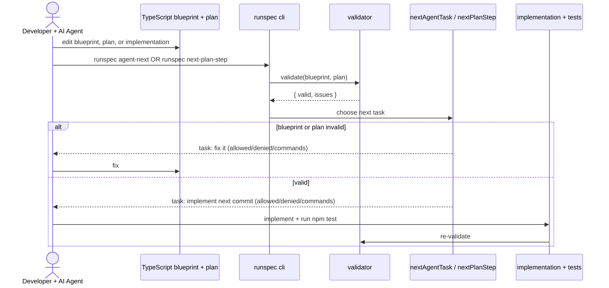
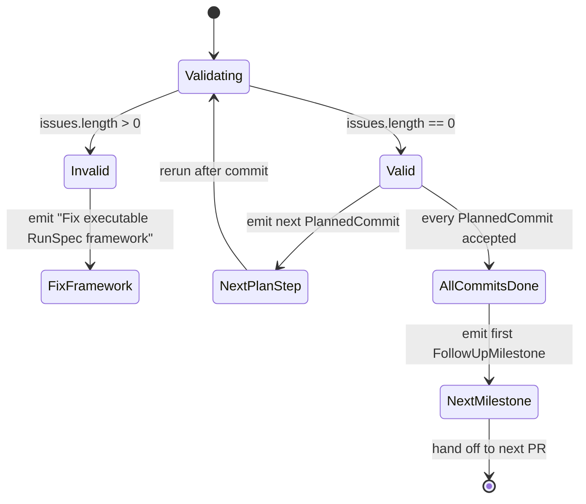

# RunSpec

> **Spec-driven development is broken when the spec is markdown.**
> RunSpec inverts the loop: **the spec IS the code.** Services, capabilities,
> scenarios, gates, threats, agent policies, and even PR plans are typed
> immutable TypeScript values. The validator runs on every change. AI agents
> read deterministic task JSON and cannot drift because there is no separate
> document to drift against.

RunSpec is an executable enterprise application builder. It replaces OpenSpec,
Spec Kit, and markdown requirement files for any application type — backend
services, frontend apps, microservices, workers.

Markdown in this repository is allowed only for:

- **Human onboarding:** `README.md`, `CONTRIBUTING.md`, `SECURITY.md`
- **AI tool runtime configuration:** `CLAUDE.md`, `AGENT.md`, `.claude/`, `.github/`

Anything describing product behaviour, requirements, design, scenarios, or
threats lives in TypeScript. Generated reports, diagrams, and evidence are
produced under `.runspec/generated/`.

## Why runspec

Spec-driven dev fails because markdown specs drift, contradict each other,
and silently let AI agents hallucinate. RunSpec eliminates that gap:

- The product is declared in code via `defineRunSpecFramework({ ... })`.
- A validator runs on every commit; rules are pure functions in a registry.
- `nextAgentTask` reads the same code and emits the agent's next task as JSON
  with explicit `allowedFiles`, `deniedFiles`, `commands`, and `acceptance`.
- Plans for each PR are themselves executable values declared under
  `src/plans/pr*.ts`; `runspec verify-plan` is the source of truth for "is
  this PR done?".

Any AI agent (Claude, Copilot, Cursor, Aider, Codex) reads the same JSON and
cannot exceed the allowed/denied surface.

## Architecture

The agent loop, closed by self-verification:



Task selection as a state machine:



## Core loop

```bash
npm test
runspec agent-next        # next capability-level task
runspec next-plan-step    # next PR-meta task
```

## Repository rules

```text
Executable definitions live in TypeScript files.
Markdown is allowed only for human onboarding (README, CONTRIBUTING, SECURITY)
and AI tool runtime configuration (CLAUDE.md, AGENT.md, .claude/, .github/).
Generated documentation lives under .runspec/generated/.
Agents may not manually edit generated output.
Agents must run npm test before claiming completion.
Application code is accepted only through executable verification gates.
```

## Commands

```bash
npm run build
runspec --help
runspec --version
runspec verify-markdown
runspec verify-blueprint
runspec verify-plan --plan src/plans/pr1.ts
runspec plan-status --plan src/plans/pr1.ts
runspec next-plan-step --plan src/plans/pr1.ts
runspec list-followups --plan src/plans/pr1.ts
runspec agent-next
runspec blueprint-print
runspec generate --capability APPLICATION_BUILDER --service go-http-service --dry-run
runspec run-harnesses --dry-run
runspec run-gates --dry-run
```

Exit codes: `0` success, `1` policy or validation failure, `2` usage error or
repository safety check failed.

## Generating service skeletons

`runspec generate` turns a typed `ProductCapability` plus a `ServiceTarget`
into a deterministic set of source files. Today four generators ship in the
default registry — `goHttpGenerator` (`go:go-http`), `goWorkerGenerator`
(`go:worker`), `springBootGenerator` (`java:spring-boot`), and
`nodeHttpGenerator` (`typescript:node-http`). React template is declared as
a `FollowUpMilestone` (blocked by `frontend-coverage`) and will land in a
subsequent PR.

```bash
# Inspect what would be written, without touching the filesystem
runspec generate \
  --capability APPLICATION_BUILDER \
  --service go-http-service \
  --dry-run

# Write the skeleton to a custom directory
runspec generate \
  --capability APPLICATION_BUILDER \
  --service go-http-service \
  --output ./out/go-skeleton

# Re-generate over an existing skeleton (overwrites files)
runspec generate \
  --capability APPLICATION_BUILDER \
  --service go-http-service \
  --output ./out/go-skeleton \
  --force
```

Generated layout per template:

- **Go HTTP** (`go-http-service`): `go.mod`, `main.go`, `domain/`,
  `usecases/`, `ports/`, `adapters/`, `repositories/`, `http/handler.go`,
  `tests/<scenario>_test.go`.
- **Spring Boot** (`spring-boot-service`): `build.gradle.kts` (Spring Boot
  4.0, Java 25, Gradle Kotlin DSL), `settings.gradle.kts`,
  `src/main/java/<package>/<ServiceName>Application.java`,
  `src/main/java/<package>/domain/`, `application/`, `ports/`, `adapters/`,
  `repositories/`, `controllers/HelloController.java`,
  `src/test/java/<package>/<Scenario>Test.java` (`@Disabled` JUnit 5 stubs).
- **Node.js HTTP** (`typescript-node-service`): `package.json`
  (Node >=24, TypeScript 5), `tsconfig.json` (ES2024, strict+), `src/main.ts`
  (createServer + Handler), `src/domain/`, `src/usecases/`, `src/ports/`,
  `src/adapters/`, `src/repositories/`, `src/http/handler.ts`,
  `test/<Scenario>.test.ts` (`node:test` skipped stubs).
- **Go worker** (`event-worker`): `go.mod` (Go 1.26), `main.go` (signal
  wait-loop bootstrap), `domain/`, `event-consumers/<event>_consumer.go`,
  `event-producers/<event>_producer.go`, `idempotency/<event>_keys.go`,
  `handlers/<scenario>.go`, `config/broker.go` (broker-agnostic),
  `tests/<scenario>_test.go`. No Kafka/RabbitMQ client SDK is imported in
  the generated stubs — the consumer/producer interfaces are framework-light
  so downstream teams pick their own client.

Every file carries a deterministic generated-by header citing the source
capability and service ids. Generators sanitise identifiers so a hostile
blueprint cannot produce paths that escape the output directory, and the CLI
`createFileWriter` enforces the same boundary as a defense-in-depth check.

## Running verification harnesses

Each `VerificationHarness` in the blueprint carries a typed
`HarnessCommand { program, args }` and an `evidenceDir`. The CLI runs them
via `spawnSync` with `shell: false` (no shell expansion) and writes one
JSON evidence file per result:

```bash
# List which harnesses would run without spawning anything
runspec run-harnesses --dry-run

# Run every declared harness; exit 0 if all pass, 1 if any fail
runspec run-harnesses

# Run only the harnesses listed by a single scenario
runspec run-harnesses --scenario APPLICATION_BUILDER-001
```

Evidence files land under each harness's `evidenceDir` (default
`.runspec/generated/evidence/<kind>/`). The default writer validates that
the resolved path stays inside the repository root, so a hostile blueprint
cannot direct evidence writes outside the working tree.

## Running quality gates

Each `QualityGate` carries the same typed `Command { program, args }` as
harnesses and an `evidence` file path. `runspec run-gates` spawns every
gate, writes evidence per gate, and exits non-zero when any blocking gate
fails:

```bash
# Inspect which gates would run
runspec run-gates --dry-run

# Run every gate; exit 0 only if every blocking gate passes
runspec run-gates
```

Evidence files land under `.runspec/generated/gates/<kind>.json`. A failing
non-blocking gate is reported in the JSON output but does not flip
`report.passed`; only a blocking gate failure causes exit code 1.

## Use runspec in your project

```ts
import {
  acceptanceCriterion,
  defineRunSpecFramework,
  defineWorkPlan,
  followUpMilestone,
  plannedCommit,
  qualityGate,
  serviceTarget,
  sourceOfTruthPolicy,
} from "runspec";

export const myApp = defineRunSpecFramework({
  name: "MyApp",
  purpose: "Issue and service loans through executable definitions.",
  sourceOfTruth: sourceOfTruthPolicy({
    executableDefinitionsOnly: true,
    markdownPolicy: {
      humanOnboarding: ["README.md", "CONTRIBUTING.md", "SECURITY.md"],
      agentRuntimeConfiguration: [".claude/", ".github/"],
      excludedDirectories: [".git", "node_modules", "dist", "build"],
    },
    generatedArtifactDirectory: ".runspec/generated",
    generatedArtifactsAreReadOnlyForAgents: true,
    commentsAsSpecificationAllowed: false,
    externalSpecFrameworksAllowed: false,
  }),
  // ...workspaceCapabilities, serviceTargets, productCapabilities,
  // threatModels, qualityGates, harnesses, diagramTargets, agentPolicy
});

export const pr1 = defineWorkPlan({
  id: "pr-1-initial",
  title: "First PR",
  thesis: "Bootstrap the project.",
  pr: { number: 1, branch: "main" },
  constraints: ["no markdown specs", "tests pass"],
  commits: [
    plannedCommit({
      id: "c1",
      subject: "feat: initial scaffold",
      rationale: "lay the ground base",
      touches: ["src/**"],
      mustNotTouch: ["dist/**"],
      acceptance: [
        acceptanceCriterion({
          id: "build-passes",
          description: "npm test exits 0",
          predicate: { kind: "npm-script-passes", script: "test" },
        }),
      ],
    }),
  ],
  delivers: [],
  followUps: [
    followUpMilestone({
      id: "auth",
      title: "Add authentication",
      thesis: "OAuth2 flow with refresh tokens.",
      outcomes: ["users can sign in"],
      nonGoals: ["passwordless"],
      blockedBy: [],
    }),
  ],
});
```

## Plans live in code, too

Each PR is declared as an executable `WorkPlan` under `src/plans/pr<N>.ts`.
Acceptance criteria use typed predicates (`module-export`, `tsconfig-flag`,
`cli-exit`, `package-json-field`, `npm-script-passes`, `file-present`,
`file-absent`, `readme-mermaid-blocks`, `module-property-equals`,
`plan-self-validates`) — never shell strings, so verification is portable and
hard for an AI agent to fake.

`runspec verify-plan` reports per-commit status. `runspec list-followups`
prints the remaining milestones with their `blockedBy` graph; the next-round
agent picks the first unblocked entry and creates `src/plans/pr<N+1>.ts`.
Nothing depends on chat history or markdown — the plan IS code.

## What runs today, what is next

**Today (PRs #1–#8):** typed domain model, identity builders, validator
with a rule registry, agent-task emitter, hardened CLI, public API surface,
WorkPlan domain, executable plans in `src/plans/pr<N>.ts`, skeleton
generator abstraction with four shipped templates (Go HTTP, Go worker,
Spring Boot, Node.js HTTP), the verification harness runner, the quality
gate executor, and frontend coverage in the model (react-spa, next, vue
service frameworks; ui-component, accessibility, visual-regression,
bundle-size harnesses; accessibility, frontend-security gates).

**Next milestones** (see `runspec list-followups --plan src/plans/pr8.ts`):
skeleton-generator-react (now unblocked), watch-mode, npm-publish,
eslint-or-biome-config, ci-coverage-gating, makefile-language-adapters,
additional-agent-task-shapes, cross-agent-policy-export.

## Main executable files

```text
src/blueprint/runSpecFramework.ts
src/plans/pr1.ts
src/plans/pr2.ts
src/plans/pr3.ts
src/plans/pr4.ts
src/plans/pr5.ts
src/plans/pr6.ts
src/plans/pr7.ts
src/plans/pr8.ts
src/core/model.ts
src/core/builders.ts
src/core/validators.ts
src/core/agent.ts
src/core/plan.ts
src/core/runner.ts
src/core/gate-executor.ts
src/core/generator.ts
src/core/generators/_shared.ts
src/core/generators/go-http.ts
src/core/generators/go-worker.ts
src/core/generators/node-http.ts
src/core/generators/spring-boot.ts
src/cli.ts
src/index.ts
```

## What this blueprint covers

```text
multi-service monorepo
multi-repo systems
Go services
Spring Boot services
Node/TypeScript services
event workers
Postgres, Kafka, RabbitMQ, Redis, Vault, object storage
HTTP APIs, event contracts, data entities
repositories, migrations
security policies, STRIDE threat modeling
architecture, observability, integration, security gates
sequence and flow diagram targets
AI agent execution policy
executable PR plans with typed acceptance predicates
```
